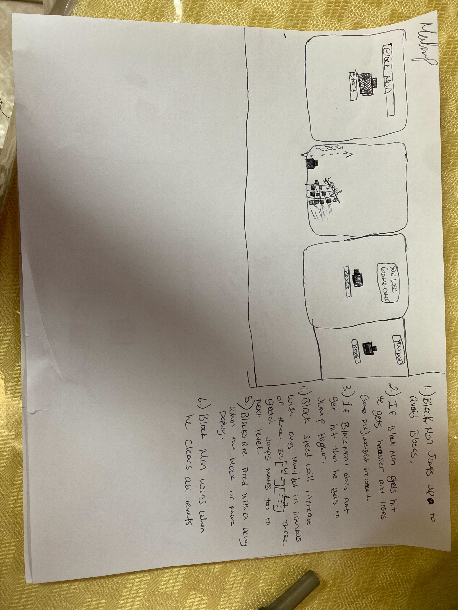

# BlockManGame
My first project
overview 
tech used 
user story 
pictures 

                                Overview                                                

Hello and welcome to the world of Block-man where you will be expected to jump your way to the finish line!
With every Block that Block Man avoids the game will get faster and Block Man jumps higher, you have three waves of blocks to jump before you can move to the next level. 
Every time Block Man takes a hit Block Man gets heavier and loses some jump strength. After three hits are take Block Man will reset and will try to prevail against the blocks again.

Tech used:
- Css
- JavaScript
- HTML

                                USER STORY

You are about to be emerged in a world of blocks. Play as Block Man and hurdle your way over incoming blocks and with every jump your journey will become more difficult but your jump strength will increase making you jump higher. How ever be warned, the blocks being fired have the ability to cling to and become part of our hero making him heavier and making him lose some jump ability with each block added. Join the perilous journey and get our hero to the end of the game without losing all your lives.  
                

